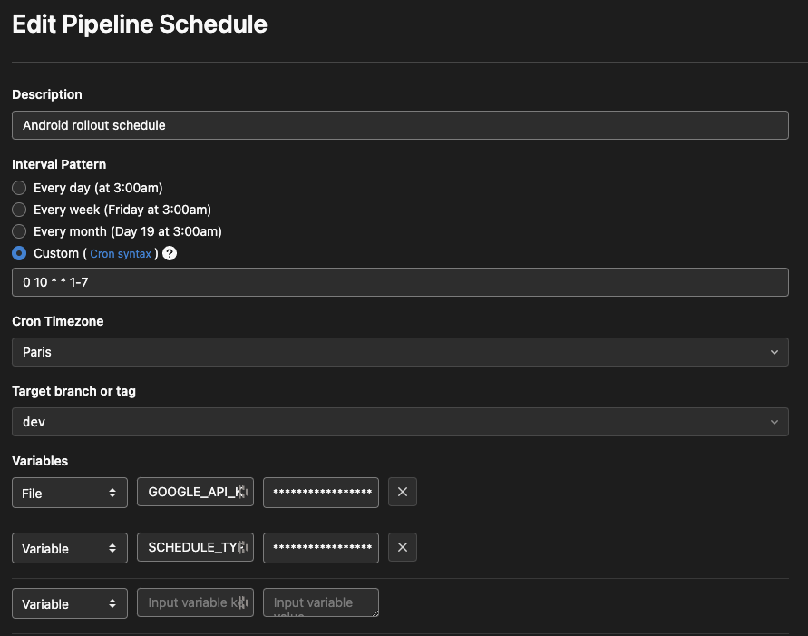

# android-rollout-node

Node script using google api to automatically increment release percentage rollout

## Configuration

1. Install the package:

```
yarn add @getluko/android-rollout-node --dev
```

2. Run the script

```
npx android-rollout-node com.package.app production ./api-google-service_account.json
```

## Gitlab CI integration

- .gitlab-ci.yml

```
stages:
  - android_rollout

android_rollout:
  rules:
    - if: $CI_PIPELINE_SOURCE == "schedule" && $SCHEDULE_TYPE == "android_rollout"
  stage: android_rollout
  script:
    - yarn
    - yarn release:rollout:android:ci
```

- $SCHEDULE_TYPE should be configure as `android_rollout` in variables
- Schedule cron to run it everyday of the week at 10am `0 10 * * 1-7`


